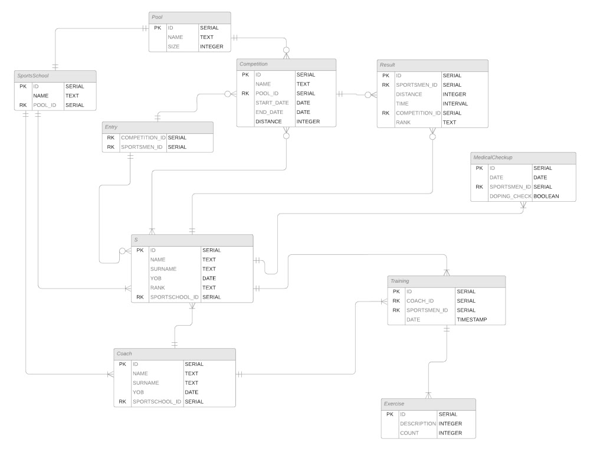

# Рефакторинг приложения

## Описание существующего приложения

### Общая информация

- [Техническое задание](pdf/requirements.pdf)
- Студент
    - Пушкин Антон Сергеевич
    
- Группа
    - P34121
- Доп сведения:
  - Курсовая работа выполнялась в паре с Аллаяровым Игорем. Проект в рамках дисциплины РБДиП буду выполнять один. При выполнении работы Игорь отвечал за front, я за backend, поэтому вижу логичным выдвигать предложения по рефакторингу относительно backend'а. 

### Предметная область

Система призвана предоставлять информацию и возможности людям, которые профессионально занимаются плаванием.

#### Возможности, предоставляемые системой:
Система, позволяющая спотрсменам производить: 
- Поиск и фильтрацию спортсменов в информационной системе.
- Просмотр рейтинга лучших спортсменов по фильтрам.
- Просмотр профиля и таблицы результатов.
- Просмотр расписания других спортсменов (при разрешении).
- Просмотр и редактирование информации о себе

Для тренеров, организаторов соревнований:
- Добавление и редактирование соревнований и информации о них.
- Добавление и редактирование результатов участия в соревнованиях спортсмена.
- Добавление и редактирование бассейнов и информации о них.
- Добавление и редактирование спортшкол и информации о них.
- Составление и редактирование расписания спортсмена (его плана тренировок с заданиями).

### Даталогическая модель

### Дополнительная информация:
[Ссылка](pdf/db-coursework.pdf) для более подробного ознакомления с курсовой работой

## Предложения по рефакторингу

### Этап 1

- [ ] Рефакторинг
  - [ ] Изменение общей структуры репозитория
  - [ ] Перенос логики работы конкретных компонентов
  - [ ] Изменение типов и url запросов согласно принципу REST
  - [ ] Перенос строковых значений в отдельные константы
  - [ ] Оптимизация SQL запросов

### Этап 2
  - [ ] Введение DTO для передачи данных
  - [ ] Добавление валидации и обработки ошибок
  - [ ] Логирование

### Этап 3

- [ ] Реализация Unit-тестов на методы сервисов